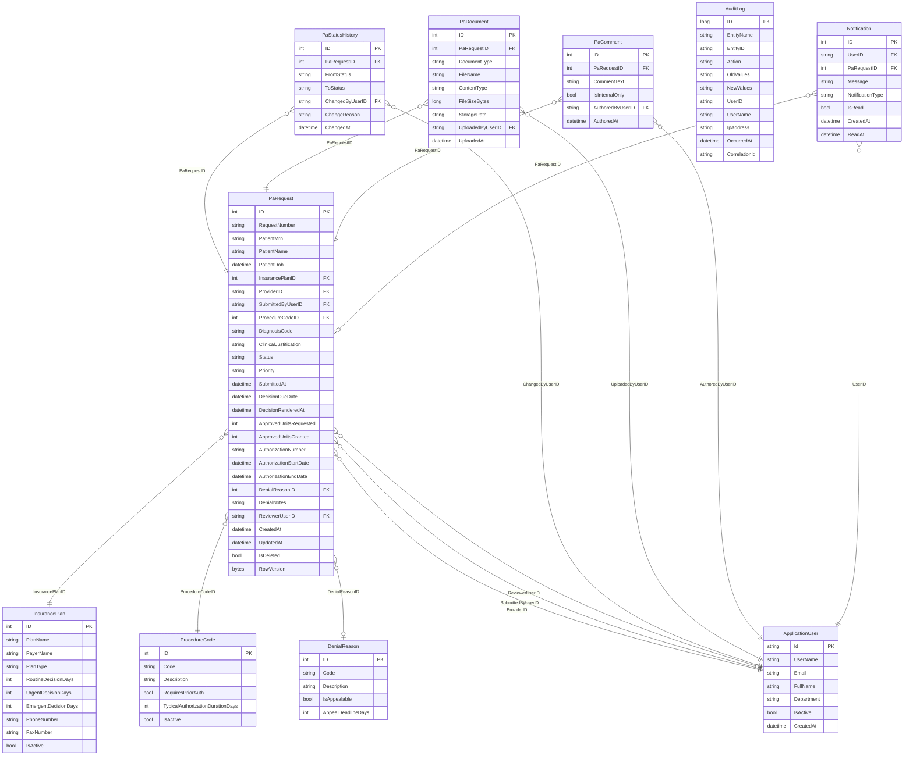

# Data Model

**Version:** 1.0 (InitialCreate migration applied)  
**Last Updated:** 2026-05-04

---

## Entity Relationship Diagram

---

## Enums (stored as strings in the database)

### PaStatus
`Draft` → `Submitted` → `UnderReview` → `Approved` / `Denied` / `PendingInfo`  
`Denied` → `Appealed` → `UnderReview` → `Approved` / `Denied`  
`Approved` → `Expired` (system)  
`Submitted` / `PendingInfo` / `UnderReview` / `Appealed` → `Withdrawn`

### PaPriority
`Routine` | `Urgent` | `Emergent`

### NotificationType
`ExpirationAlert` | `StatusChanged` | `AppealWindow` | `DecisionRendered`

---

## Index Summary (§7.3 + NFR-001 additions)

| Index Name | Table | Columns | Notes |
|---|---|---|---|
| `IX_PaRequests_Status` | PaRequests | Status | §7.3 |
| `IX_PaRequests_PatientMrn` | PaRequests | PatientMrn | §7.3 |
| `IX_PaRequests_DecisionDueDate` | PaRequests | DecisionDueDate | §7.3 |
| `IX_PaRequests_SubmittedByUserID` | PaRequests | SubmittedByUserID | §7.3 |
| `IX_PaRequests_ReviewerUserID` | PaRequests | ReviewerUserID | IDX-001 — reviewer queue filter + dashboard (NFR-001) |
| `IX_PaRequests_ProviderID` | PaRequests | ProviderID | IDX-002 — provider-scoped queue + dashboard (NFR-001) |
| `UX_PaRequests_AuthorizationNumber` | PaRequests | AuthorizationNumber | **Unique partial** (filter: IS NOT NULL) — BUG-01 DB safety net |
| `IX_PaStatusHistory_PaRequestID` | PaStatusHistories | PaRequestID | §7.3 |
| `IX_AuditLogs_OccurredAt` | AuditLogs | OccurredAt | §7.3 |
| `IX_AuditLogs_EntityID_EntityName` | AuditLogs | EntityID, EntityName | §7.3 |
| `IX_Notifications_UserId_IsRead` | Notifications | UserID, IsRead | §7.3 |

---

## Migration History

| Migration | Date | Description |
|---|---|---|
| `InitialCreate` | 2026-05-04 | All 10 application tables + Identity tables; all indexes and FK constraints |
| `AddReportingViews` | 2026-05-05 | Four SQL reporting views (`vw_PaRequestSummary`, `vw_DenialsByReason`, `vw_RequestVolumeByMonth`, `vw_ExpiringAuthorizations`) |
| `AddAuthorizationNumberUniqueIndex` | 2026-05-05 | Unique partial index `UX_PaRequests_AuthorizationNumber` (BUG-01 DB safety net) |
| `AddReviewerAndProviderIndexes` | 2026-05-05 | `IX_PaRequests_ReviewerUserID` and `IX_PaRequests_ProviderID` (IDX-001/IDX-002, NFR-001 performance) |

---

## Reporting Views

| View | Description |
|---|---|
| `vw_PaRequestSummary` | Denormalized join across PaRequests + Plans + Codes + Users |
| `vw_DenialsByReason` | Denial counts/percentages grouped by DenialReasonID |
| `vw_RequestVolumeByMonth` | Submissions grouped by year-month and status |
| `vw_ExpiringAuthorizations` | Approved requests with AuthorizationEndDate within configurable window |

All four views were added in the `AddReportingViews` migration (2026-05-05).

---

## Seed Data (§14.2)

`DbSeeder` runs in `Development` only, is idempotent, and produces data relative to `DateTime.UtcNow.Date` so it stays fresh on every new install.

| Entity | Target | Method |
|---|---|---|
| Insurance Plans | 8 | `SeedInsurancePlansAsync` |
| Procedure Codes | 25 | `SeedProcedureCodesAsync` |
| Denial Reasons | 12 | `SeedDenialReasonsAsync` |
| PA Requests | 50 (exact per §14.3 distribution) | `SeedPaRequestsAsync` |
| PA Status History | ~125 (avg 2.5/request) | `SeedPaRequestsAsync` |
| PA Comments | 72 | `SeedPaRequestsAsync` |
| Audit Log rows | ~300 | `SeedAuditLogsAsync` |
| Notifications | varies (DecisionRendered, AppealWindow, StatusChanged, ExpirationAlert) | `SeedNotificationsAsync` |

**§14.3 status distribution (exact):**

| Status | Count |
|---|---|
| Draft | 3 |
| Submitted | 6 |
| PendingInfo | 5 |
| UnderReview | 7 |
| Approved | 15 |
| Denied | 7 |
| Appealed | 3 |
| Withdrawn | 2 |
| Expired | 2 |
| **Total** | **50** |

**Specialist/provider distribution:** Approved requests alternate between `specialist1`/`specialist2` and are split evenly across `provider1`, `provider2`, `provider3` (5 each) to produce varied provider volume report output.

---

## Known Constraints and Tradeoffs

| Item | Decision | Tradeoff |
|---|---|---|
| **Document storage** | Metadata only (StoragePath string); no blob bytes persisted | Simplifies v1; requires file system / Azure Blob integration in v2 |
| **Email notifications** | Stub only; Notification rows created but no SMTP call | No external dependency in dev; requires email service in v2 |
| **Enums as strings** | All status/priority enums stored as nvarchar | Human-readable migrations; slight storage overhead vs. int |
| **Soft delete** | Global query filter via `HasQueryFilter` | Clean call sites; accidental `IgnoreQueryFilters()` misuse could expose deleted data |
| **SYSTEM user** | Hard-coded ID `00000000-0000-0000-0000-000000000001` | Simple; must be seeded before `ExpirationJob` starts |
| **Seed data dates** | `DateTime.UtcNow.Date`-relative | Stays current; different installs have different absolute dates (acceptable for demo) |
