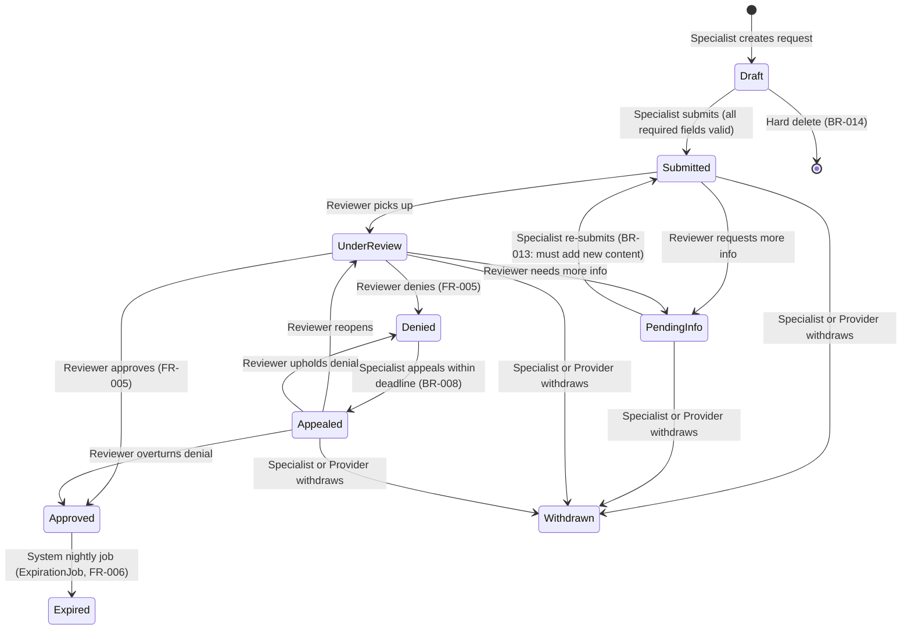

# Workflow State Machine

**Last Updated:** 2026-05-05

---

## Valid Status Transitions (FR-004)



### Transition Permission Matrix

| From → To | Who can trigger |
|---|---|
| Draft → Submitted | Authorization Specialist |
| Submitted → UnderReview | Payer Reviewer |
| Submitted → PendingInfo | Payer Reviewer |
| PendingInfo → Submitted | Authorization Specialist (BR-013) |
| UnderReview → Approved | Payer Reviewer |
| UnderReview → Denied | Payer Reviewer |
| UnderReview → PendingInfo | Payer Reviewer |
| Approved → Expired | SYSTEM (ExpirationJob) |
| Denied → Appealed | Authorization Specialist (within BR-008 deadline) |
| Appealed → UnderReview | Payer Reviewer |
| Appealed → Denied | Payer Reviewer |
| Appealed → Approved | Payer Reviewer |
| Any active → Withdrawn | Specialist or Provider (BR-009: Submitted, PendingInfo, UnderReview, Appealed only — not Draft, Approved, Expired, Denied) |
| Draft → (delete) | Specialist who created it, or Administrator (BR-014) |

---

## Business Rules Summary

| Rule | Description | Enforcement |
|---|---|---|
| BR-001 | ProcedureCode.RequiresPriorAuth must be true | BusinessRuleValidator |
| BR-002 | DecisionDueDate = SubmittedAt + plan SLA days (per Priority) | PaRequestService.Submit |
| BR-003 | DiagnosisCode matches ICD-10 regex `^[A-Z][0-9]{2}(\.[0-9A-Z]{1,4})?$` | BusinessRuleValidator |
| BR-004 | ApprovedUnitsRequested 1–999 | BusinessRuleValidator |
| BR-005 | No duplicate active request for same Patient+ProcedureCode+InsurancePlan | BusinessRuleValidator (FK-based, not PayerName) |
| BR-006 | AuthorizationEndDate > AuthorizationStartDate | BusinessRuleValidator |
| BR-007 | ApprovedUnitsGranted ≤ ApprovedUnitsRequested | BusinessRuleValidator |
| BR-008 | Appeal only within DenialReasons.AppealDeadlineDays of DecisionRenderedAt | WorkflowService |
| BR-009 | Cannot Withdraw from Approved, Expired, or Denied | WorkflowService |
| BR-010 | ClinicalJustification ≥ 50 characters | BusinessRuleValidator |
| BR-011 | AuthorizationStartDate ≥ today (via IDateTimeProvider) | BusinessRuleValidator |
| BR-012 | ApprovedUnitsGranted ≥ 1 | BusinessRuleValidator |
| BR-013 | PendingInfo → Submitted requires new comment or document added after entering PendingInfo | WorkflowService (reads PaStatusHistory for PendingInfo entry timestamp) |
| BR-014 | Hard delete only for Draft by its creator or Admin; all others soft-delete | PaRequestService |

---

## Audit Events Written on Each Transition

| Event | EntityName | Action |
|---|---|---|
| Request created (Draft saved) | PaRequest | Created |
| Draft → Submitted | PaRequest | StatusChanged |
| Any status transition | PaRequest | StatusChanged |
| Approval decision | PaRequest | DecisionRendered |
| Denial decision | PaRequest | DecisionRendered |
| Appeal filed | PaRequest | AppealFiled |
| Request withdrawn | PaRequest | Withdrawn |
| Request expired | PaRequest | Expired |
| Comment added | PaComment | Created |
| Document uploaded | PaDocument | Uploaded |
| User created | User | Created |
| User deactivated | User | Deactivated |
| Role changed | User | RoleChanged |
| Admin override | PaRequest | AdminOverride |
| Login | User | Login |
| Failed login | User | FailedLogin |
| CSV export | PaReport | ExportDownloaded |

---

## ExpirationJob Behavior (FR-006)

- Registered as `IHostedService`; fires daily at midnight (UTC)
- Queries: `PaRequests WHERE Status = 'Approved' AND AuthorizationEndDate < UtcNow AND IsDeleted = 0`
- For each match: transitions status to `Expired` via `WorkflowService` using SYSTEM user ID
- Creates `Notification` records for the SubmittedByUser (Specialist) and Provider
- Guard: checks status = Approved before update to prevent double-expiration (BUG-008 mitigation)
- **Manual trigger (T-C2, PRD §8.8):** Also implements `IExpirationJobTrigger`. Admin can click "Run Expiration Check" in `Users.razor` to run the same check on demand. Returns expired-count displayed in a toast.

---

## Appeal Window UI (T-F2, PRD §8.5)

When a request is in `Denied` status, `RequestDetail.razor` evaluates appeal eligibility:
```
eligible = DenialReason.IsAppealable
           AND UtcNow <= DecisionRenderedAt + DenialReason.AppealDeadlineDays
```
- **Eligible:** shows an active "File Appeal" button (visible to Authorization Specialist and Administrator only).
- **Ineligible / expired:** shows a disabled "Appeal window closed" button with tooltip explaining why.

The server enforces the same rule in `WorkflowService.AppealAsync` (BR-008). The UI check is purely informational — it never replaces the service-level guard.

---

## BR-013 Re-submission Logic

When a Specialist re-submits a PendingInfo request:
1. `WorkflowService` reads `PaStatusHistory` for the last row where `ToStatus = PendingInfo`
2. Gets `ChangedAt` timestamp from that row
3. Queries `PaComments` and `PaDocuments` for any records with `AuthoredAt` / `UploadedAt` > that timestamp
4. If count = 0, throws `BusinessRuleViolationException("BR-013", ...)`

This approach reads from `PaStatusHistory`, not `PaRequest.UpdatedAt` (BUG-014 mitigation).

---

## Appealed-State Transitions — Service Implementation Notes (§3.27)

FR-004 defines three valid transitions that originate from `Appealed`. Prior to the §3.27 fix, these threw `WorkflowTransitionException` despite the `Transitions` dictionary listing them correctly, because the guard logic hardcoded the expected from-status.

| Service method | Accepted from-statuses | Appeal-path meaning |
|---|---|---|
| `BeginReviewAsync` | `Submitted`, `Appealed` | Reopens the request for secondary review |
| `ApproveAsync` | `UnderReview`, `Appealed` | Appeal overturned — original denial reversed |
| `DenyAsync` | `UnderReview`, `Appealed` | Appeal upheld — original denial stands |

Each method captures `var fromStatus = request.Status` before mutating the entity, so `PaStatusHistory.FromStatus` and `AuditLog.OldValues` always reflect `Appealed` (not the target status's expected predecessor).
